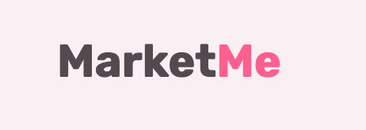
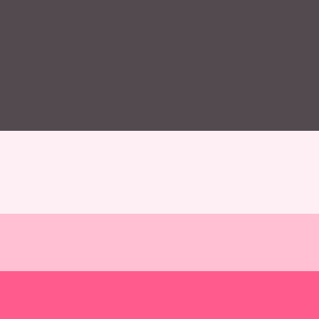
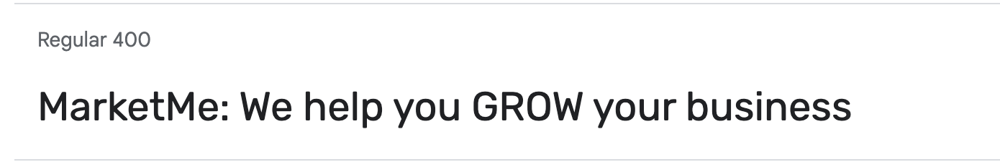
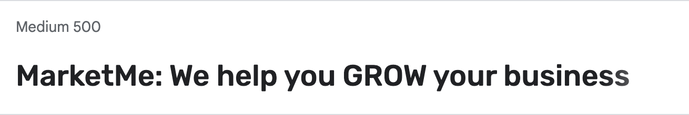
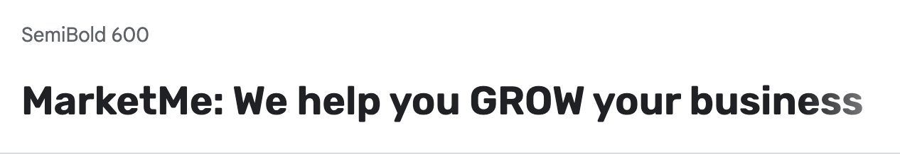
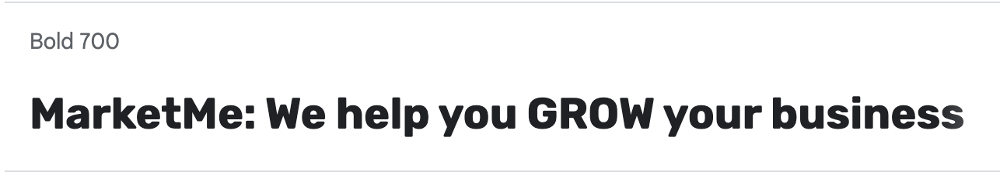

# MarketMe

MarketMe is a website that provides services for business owners and brands to increase their exposure online and increase the number of sales and clients for their business. Visitors

This website can be accessed by this [link]()

## User Stories

### First time visior goals:

- First
- awcond
- third

## Design

### Color Scheme

-

### Typography

- Rubik Google Font was used as font through the whole website as it is very readable and very aesthetic. Only the weight of the font was changed througout the website from 400,500,600 and 700

## Deployment

- The site was deployed to GitHub pages. The steps to deploy are as follows:
  - In the [GitHub repository](https://github.com/Omar-Alme/marketing-agency), navigate to the Settings tab
  - From the source section drop-down menu, select the **Main** Branch, then click "Save".
  - The page will be automatically refreshed with a detailed ribbon display to indicate the successful deployment.

The live link can be found [here]()

## Local Deployment

In order to make a local copy of this project, you can clone it.
In your IDE Terminal, type the following command to clone my repository:

-     'git clone https://github.com/Omar-Alme/marketing-agency'

## Credits

- #### Content

  - [case study](https://blog.hubspot.com/marketing/case-study-examples)
  - [bug](https://phoenixnap.com/kb/git-stash-untracked-files#:~:text=An%20untracked%20file%20in%20Git,explicitly%20told%20to%20include%20them.)
  - [remove background](https://www.remove.bg/b/remove-logo-backgrounds)
  - [Flex box or grid](https://www.youtube.com/watch?v=3elGSZSWTbM)
  - [Dribble inspiration 1](https://dribbble.com/shots/21027583-LinkLeap-SMMA)
  - [Dribble inspiration 2](https://dribbble.com/shots/21217693-Marketing-agency-Smma-landing-page)
  - [grid template](https://developer.mozilla.org/en-US/docs/Web/CSS/grid-template-rows)
  - [ReadMe guide](https://github.com/tchapi/markdown-cheatsheet/blob/master/README.md)

- #### Media

For the illustrations [UnDraw](https://undraw.co/illustrations) was used through out the website.

For the testimonials sectiion [Random user generator](https://randomuser.me/photos) was used to get the 3 photos.

## Acknowledgements

- [Awesome Readme Templates](https://awesomeopensource.com/project/elangosundar/awesome-README-templates)
- [Awesome README](https://github.com/matiassingers/awesome-readme)
- [How to write a Good readme](https://bulldogjob.com/news/449-how-to-write-a-good-readme-for-your-github-project)

- [Kevin bowle on CSS grid and Flex](https://www.youtube.com/@KevinPowell)

- [Dr.Angela Yu web development bootcamp](https://www.udemy.com/course/the-complete-web-development-bootcamp/)
- [CodingHeroes resources](https://codingheroes.io/resources/)
