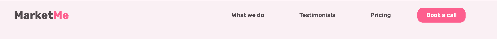
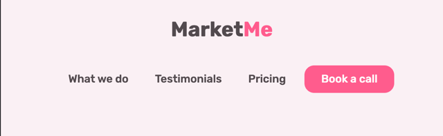
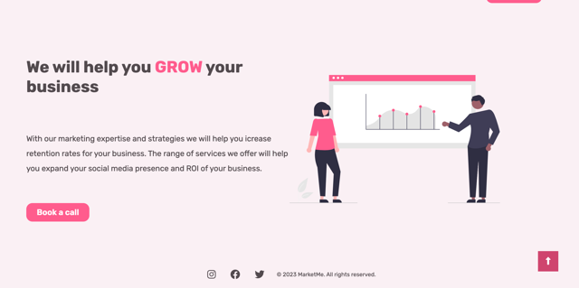
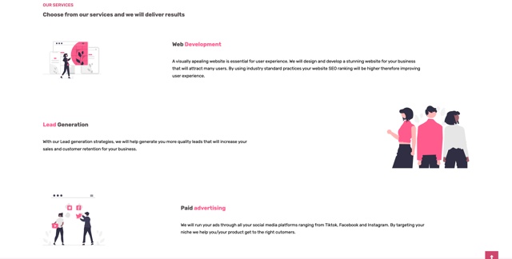

# MarketMe

MarketMe is a website that provides services for business owners and brands to increase their exposure online and increase the number of sales and clients for their business. Visitors

This website can be accessed by this [link]()

## User Stories

### First time visior goals:

- First
- awcond
- third

## Features

### Navigation Bar
+ #### Navigation
    - Positioned at the top of the page.
    - Contains logo of the company on the left side. (MarketMe)
    - Contains navigation links on the right side:
        * What we do - This link redirects the user to our services section of MarketMe.
        * Testimonials - This link redirects the user to our testimonials section of MartketMe
        * Pricing - This link redirects the user to our pricings section of MartketMe
        * Book a call - This button redirects you to Call to action section of MarketMe
    - The links have animated hover effect where the colour changes to a pink.
    - The Book a call button link changes to a darker shade of pink when you hover over it. 
    - The navigation is clear and easy to understand for the user.
    

    - Responsiveness:
        * On tablets: All elements are centered and is split into two colums, the MarketMe on top and the navigation links right under it.
        

        <!-- * On mobile devices: 
            - navigation bar filled with the logo in the center and a hamburger menu implemented on the left side of the navigation bar.      
            
        
            - When the hamburger menu is clicked, there is dropdown menu with the links in the same order.
             -->
### Hero Section
 + #### First Section
    - Seperated into two column sections using grid. One column is the textarea with the heading and paragraph and a call to action button. The other is the image area.
       - Goal of Section
          - Shows the user main purpose of the website.
          - Explains the service the website offers
          - Invites and Redirects user to call to action section of the website to fill out a form.
    

    - Responsiveness:
        * On small tablets: All elements are centered and aligned in one column. Heading and paragraph, Call to action button and image area last.
        

### Services Section
 + #### Second Section
    - Flex-box was used for the services
    - Seperated into 3 rows, each row with 2 divs (image and service provided)
    - Flex reverse row is used for the second service to add a beautiful mirror design to the website.
       - Goal of Section
          - Shows the user the service provided by the website.
          - Explains the service the website offers
    

    - Responsiveness:
        * On small tablets: All elements are centered and aligned in one column.
                

## Design

### Color Scheme

-

### Typography

- Rubik Google Font was used as font through the whole website as it is very readable and very aesthetic. Only the weight of the font was changed througout the website from 400,500,600 and 700

## Deployment

- The site was deployed to GitHub pages. The steps to deploy are as follows:
  - In the [GitHub repository](https://github.com/Omar-Alme/marketing-agency), navigate to the Settings tab
  - From the source section drop-down menu, select the **Main** Branch, then click "Save".
  - The page will be automatically refreshed with a detailed ribbon display to indicate the successful deployment.

The live link can be found [here]()

## Local Deployment

In order to make a local copy of this project, you can clone it.
In your IDE Terminal, type the following command to clone my repository:

-      git clone https://github.com/Omar-Alme/marketing-agency

## Credits

- #### Content

  - [bug](https://phoenixnap.com/kb/git-stash-untracked-files#:~:text=An%20untracked%20file%20in%20Git,explicitly%20told%20to%20include%20them.)
  - [remove background](https://www.remove.bg/b/remove-logo-backgrounds)
  - [Flex box or grid](https://www.youtube.com/watch?v=3elGSZSWTbM)
  - [Dribble inspiration 2](https://dribbble.com/shots/21217693-Marketing-agency-Smma-landing-page)
  - [Grid template](https://developer.mozilla.org/en-US/docs/Web/CSS/grid-template-rows)
  - [ReadMe guide](https://github.com/tchapi/markdown-cheatsheet/blob/master/README.md) Cheatsheet for R
  - [Scroll Up Page Button](https://www.youtube.com/watch?v=Vef9bxTilCU) This video helped inspire to implement the scroll up button feature on MarketMe website.
  - [Awesome README](https://github.com/matiassingers/awesome-readme)This was used to understand how to write a better ReadMe file and for layout ideas.
  - [How to write a Good readme](https://bulldogjob.com/news/449-how-to-write-a-good-readme-for-your-github-project) This was used to understand how to write a better ReadMe file and for layout ideas.
  - [CodingHeroes resources](https://codingheroes.io/resources/)Coding heroes includes a bunch of other external resources for web developers that can be helpful for them.

- #### Media

For the illustrations [UnDraw](https://undraw.co/illustrations) was used through out the website.

For the testimonials sectiion [Random user generator](https://randomuser.me/photos) was used to get the 3 photos.

## Acknowledgements

- [Kevin bowle on CSS grid and Flex](https://www.youtube.com/@KevinPowell)

- [Dr.Angela Yu web development bootcamp](https://www.udemy.com/course/the-complete-web-development-bootcamp/)

