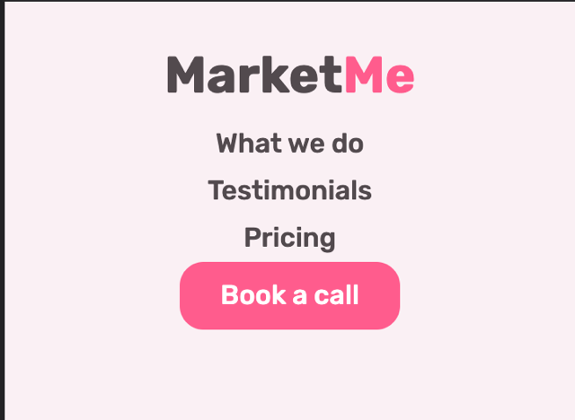

# MarketMe

MarketMe is a website that provides services for business owners and brands to increase their exposure online and increase the number of sales and clients for their business. Visitors

This website can be accessed by this [link](https://omar-alme.github.io/marketing-agency/)

Here is a link to preview the website on all screens [Responsive Preview](https://ui.dev/amiresponsive?url=https://omar-alme.github.io/marketing-agency/)

## User Stories

### Visior goals:

- As a first time visitor, I want to easily see the purpose of the website, so I can know if the agency offers what I need.
- As a first time visitor, I want to clearly understand the services provided by the website, so I can know if it suits my demands.
- As a first time visitor, I want to see the pricing plans offered by the website, so I can see if it is within my budget.
- As a first time visiot, I want to see that previous customers used the services, so I can see that the agency is trustworthy.

- As a returning visitor, I want to book a demo call easily, So i can understand the service i picked meet my requirements
- As a returning Visitor, I want to find a way to get in contact with the agency, so that I can ask additional questions and personalise a plan that best suits me.
- As a returning visitor, I want to see testimonials and experience of other clients who used the services, so that i can see that the agency is reliable and delivers results

## Features

### Navigation Bar
+ #### Navigation
    - Positioned at the top of the page.
    - Contains logo of the company on the left side. (MarketMe)
    - Contains navigation links on the right side:
        * What we do - This link redirects the user to our services section of MarketMe.
        * Testimonials - This link redirects the user to our testimonials section of MartketMe
        * Pricing - This link redirects the user to our pricings section of MartketMe
        * Book a call - This button redirects you to Call to action section of MarketMe
    - The links have animated hover effect where the colour changes to a pink.
    - The Book a call button link changes to a darker shade of pink when you hover over it. 
    - The navigation is clear and easy to understand for the user.
    

    - Responsiveness:
        * On tablets: All elements are centered and is split into two colums, the MarketMe on top and the navigation links right under it.
        

        * On small devices/mobile devices: 
            - navigation bar filled with the logo in the center nav links in a column.      
            
        
### Hero Section
 + #### First Section
    - Seperated into two column sections using grid. One column is the textarea with the heading and paragraph and a call to action button. The other is the image area.
       - Goal of Section
          - Shows the user main purpose of the website.
          - Explains the service the website offers
          - Invites and Redirects user to call to action section of the website to fill out a form.
    

    - Responsiveness:
        * On mobiles & small tablets: All elements are centered and aligned in one column. Heading and paragraph, Call to action button and image area last.
        

### Services Section
 + #### Second Section
    - Flex-box is used for the services
    - Seperated into 3 rows, each row with 2 divs (image and service provided)
    - Flex reverse row is used for the second service to add a beautiful mirror design to the website.
       - Goal of Section
          - Shows the user the service provided by the website.
          - Explains the service the website offers
    

    - Responsiveness:
        * On mobile & small tablets: All elements are centered and aligned in one column.
        

### Testimonials Section
 + #### Third Section
    - Flex-box is used for the testimonials
    - 3 testimonial boxes in one row
    - Each with an image of the client, clients experince with MartketMe, and name and title of client.
       - Goal of Section
          - Shows the user client testimonials to make the website more trustworthy.
          - Gives marketMe credibility.
    

    - Responsiveness:
        * On mobile & tablets: All elements are centered and aligned in one column.
        

### Pricing Section
 + #### Fourth Section
    - Flex-box is used for the Pricing cards
    - 3 pricing cards in this section
    - Each with a header, price and currency, list of features that come with the different plans, and call to action button.
       - Goal of Section
          - Give the user a variety of prices to choose from that are reasonable to market demand.
          - Give user options so user is comfortable picking what suits the budget.
          - Redirects user to book a call with MarketMe.
    

    - Responsiveness:
        * On mobile & tablets: All elements are centered and aligned in one column.
        

### Book a call Section
 + #### Last Section
    - Form with inputs and call to action button
    - All inputs fields are customised
    - All inputs are set so it is required to fill them
    - Book a call button changes coour layout on hover
    - It has a select dropdown menu for user to select from the pricing plans options
       - Goal of Section
          - Allows user to fill a form and book a call.         
    

    - Responsiveness:
        * Responsive in all screens.

### Footer
 + #### Sticky footer
    - Sticky footer as seen in all sections. Has a fixed position
    - Includes social platforms for MarketMe
    - Includes copyrights
       - Goal of Section
          - Redirects users to social media links for MarketMe.         
    

    - Responsiveness:
        * Responsive in all screens but changes style for mobile. 
    

### Scroll up button 
  - Fix position and sticky
  - Floating at the bottom right of the page 
  - Goal is to redirect user back to the top of the page from any section.  

  ### Response Page
 + #### Response.html
    - After user fills form and presses button they are redirected to this page.
       - Goal of Section
          - Submit the form and thank the user for booking.         
    

    - Responsiveness:
        * Responsive in all screens.
        
    
    
   
## Technologies Used

- [HTML](https://developer.mozilla.org/en-US/docs/Web/HTML) was used as the foundation of the site.
- [CSS](https://developer.mozilla.org/en-US/docs/Web/css) - was used to add the styles and layout of the site.
- [CSS Flexbox](https://developer.mozilla.org/en-US/docs/Learn/CSS/CSS_layout/Flexbox) - was used to arrange items on the pages.
- [CSS Grid](https://developer.mozilla.org/en-US/docs/Web/CSS/grid) - was used to make the hero section responsive.
- [CSS Grid-Template-columns](https://developer.mozilla.org/en-US/docs/Web/CSS/grid-template-columns) - was used in hero section.
- [CSS roots](https://developer.mozilla.org/en-US/docs/Web/CSS/:root) was used to declaring global CSS variables and apply them throughout the project. 
- [Balsamiq](https://balsamiq.com/) was used to make wireframes for the website.
- [VSCode](https://code.visualstudio.com/) was used as the main tool to write and edit code.
- [Git](https://git-scm.com/) was used for the version control of the website.
- [GitHub](https://github.com/) was used to host the website.
- [remove background](https://www.remove.bg/b/remove-logo-backgrounds) was used to remove backgrounds from images.
- [FontAwesome](https://fontawesome.com/) used for icons in the pricing cards.
- [UI Amiresponsive](https://ui.dev/amiresponsive) Preview responsiveness of website.

## Design

### Color Scheme

- The colour pink has many psychological effects on the human brain. It is associated with love and kindess and optimism. It was used throughout the project with 3 different shades mostly light. This was implemented to give the user a sense of comfort and trust, it is also very readible and easy on the eye which will keep the user comfortable scrolling through the website.

- The colour brown is associated with calmness and comfort. This contrast with the pink will keep the user happy and calm. 

- As the goal of the website to sell a service, trust is needed and simplicity for a clear mind for the user. The psychological affects of these two colours combines will make the user feel at home and optimistic that MarketMe will deliver the results and can be trusted.

### Typography

- Rubik Google Font was used as font through the whole website as it is very readable and very aesthetic. Only the weight of the font was changed througout the website from 400,500,600 and 700

### Wireframes

#### Index.html

- [Wireframe. Desktop Screen](documentations/desktop-marketme.png)
- [Wireframe. Tablet Screen](documentations/tablet-marketme.png)
- [Wireframe. Mobile Screen](documentations/mobile-marketme.png)

No wireframes for response page. As the original idea did not need this page, however later on realised a response page would be useful for call to action section to do something.

## Manual Testing

Manual testing was performed on the following devices:

* Laptop:
  * Macbook pro
* Mobile Devices:
  * iPhone 13 pro.
  
Tthe following browsers were used to test:

* Google Chrome
* Safari
* Firefox

| Feature | Expected Outcome | Testing Performed | Result | Pass/Fail |
| --- | --- | --- | --- | --- |
| The Sites title | Link directs the user back to the home page | Clicked title | Home page reloads | Pass |
| Nav links - hover effect | All nav links should change from brown colour to pink when hovered | Hover over each nav link | Each nav link displayed the correct colour when hovered over | Pass |
| All pink buttons - hover effect | Button should change to a darker shade of pink when hovered over |  Hover over all pink buttons  | Changes to darker shade of pink when hovered over | Pass |
| All pink buttons | Directs the user to the Book a call form section | Clicked on all pink buttons | Scrolls to the bottom of the page to the Book a call form | Pass |
| Form button - hover efffect | Brown button with white text and When hovered should change to white button and brown text | Hover over button | Changes to white button and brown text when hovered | Pass |
| Full name Input | Full name entered, if not error "Please fill in" should appear | Click button without entering full name | Error asking the user to fill in the full name input appears | Pass |
| Select a plan Dropdown | Options to show up when dropwdown button clicked | Click on dropdown | All options show up and user must select one | Pass |
| Form button - after filling form | Redirect user to the respone.html page | Click on button after filling form correctly | User is redirected to response.html page | Pass |

### Bugs
+ #### Solved bugs
    1. Because i cloned repo in home directory, my terminal was not allowing me to do anything because of untracked files.
    
    Solution: [bug](https://phoenixnap.com/kb/git-stash-untracked-files#:~:text=An%20untracked%20file%20in%20Git,explicitly%20told%20to%20include%20them.) By moving the untracked file to gitignore, I solved this bug.

## Validator testing
+ ### HTML
  #### Index Page
    - No errors or warnings were found when passing through the official W3C validator.

    

  #### Response Page  
  - No errors or warnings were found when passing through the official W3C validator.

    

+ ### CSS 
   No errors or warnings were found when passing through the official W3C (Jigsaw) validator:

    

+ ### Accessibility and performance 
    - Using lighthouse in devtools I confirmed that the website is performing well, accessible and colors and fonts chosen are readable.
    
  #### Index page

  

  #### Response page

  

## Deployment

- The site was deployed to GitHub pages. The steps to deploy are as follows:
  - In the [GitHub repository](https://github.com/Omar-Alme/marketing-agency), navigate to the Settings tab
  - From the source section drop-down menu, select the **Main** Branch, then click "Save".
  - The page will be automatically refreshed with a detailed ribbon display to indicate the successful deployment.

The live link can be found [here](https://omar-alme.github.io/marketing-agency/)

## Local Deployment

In order to make a local copy of this project, you can clone it.
In your IDE Terminal, type the following command to clone my repository:

-      git clone https://github.com/Omar-Alme/marketing-agency

## Credits

- #### Content
  - [Blockquote](https://developer.mozilla.org/en-US/docs/Web/HTML/Element/blockquote) helped me solve one of my html warnings after validation test.
  - [Figure](https://developer.mozilla.org/en-US/docs/Web/HTML/Element/figure)
  - [Dribble inspiration](https://dribbble.com/shots/21217693-Marketing-agency-Smma-landing-page) Inspired some of the website design ideas
  - [ReadMe guide](https://github.com/tchapi/markdown-cheatsheet/blob/master/README.md) Cheatsheet for ReadMe
  - [Scroll Up Page Button](https://www.youtube.com/watch?v=Vef9bxTilCU) This video helped inspire to implement the scroll up button feature on MarketMe website.
  - [Awesome README](https://github.com/matiassingers/awesome-readme) This was used to understand how to write a better ReadMe file and for layout ideas.
  - [How to write a Good readme](https://bulldogjob.com/news/449-how-to-write-a-good-readme-for-your-github-project) This was used to understand how to write a better ReadMe file and for layout ideas.
  - [CodingHeroes resources](https://codingheroes.io/resources/) Coding heroes includes a bunch of other external resources for web developers that can be helpful for them.
  - [Colour psychology](https://www.vandelaydesign.com/the-psychology-of-color-in-web-design/#:~:text=The%20color%20is%20known%20to,very%20strongly%20with%20youthful%20femininity.) Gave an insight on the psychology of colours in web development.
  -[Linking html to a section in another html page](https://stackoverflow.com/questions/17687328/getting-a-link-to-go-to-a-specific-section-on-another-page) helped redirect me to desired section in index.html from response.html.

- #### Media

For the illustrations [UnDraw](https://undraw.co/illustrations) was used through out the website.

For the testimonials section [Random user generator](https://randomuser.me/photos) was used to get the 3 photos.

The images for the websites don't have specific URL's to them, they were saved from the websites above.

  + Hero image:
      - [1st image UnDraw](documentations/hero.svg)

  + Services Section: 
      - [1st image UnDraw](documentations/web-dev-services.svg)
      - [2nd image UnDraw](documentations/lead-gen.svg)
      - [3rd image Undraw](documentations/paid-marketing.svg)
 
  + Services Section: 
      - [1st image Randomuser](documentations/ahmed.webp)
      - [2nd image Randomuser](documentations/jack.webp)
      - [3rd image Randomuser](documentations/rob.webp)  
  

## Acknowledgements

- [Kevin bowle on CSS grid and Flex](https://www.youtube.com/@KevinPowell)

- [Dr.Angela Yu web development bootcamp](https://www.udemy.com/course/the-complete-web-development-bootcamp/)

- [Juliaa Konovalova](https://github.com/IuliiaKonovalova) was my mentor throughout the project, inspired some of the technologies and ideas for this project.

